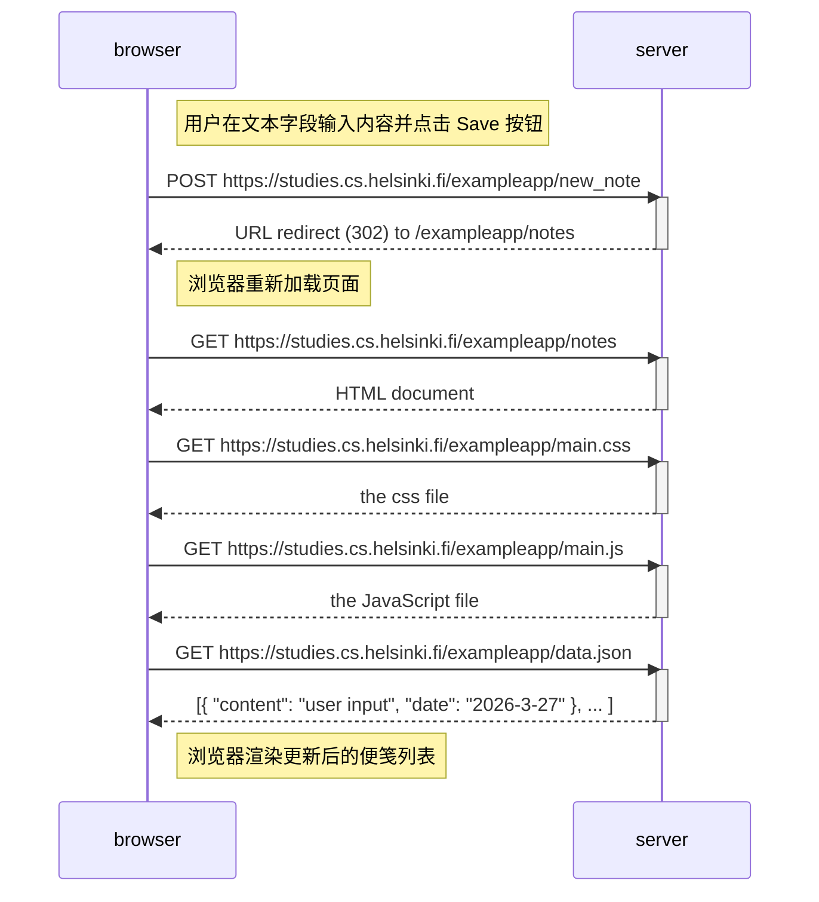

```mermaid
sequenceDiagram
    participant browser
    participant server

    Note right of browser: 用户在文本字段输入内容并点击 Save 按钮

    browser->>server: POST https://studies.cs.helsinki.fi/exampleapp/new_note
    activate server
    server-->>browser: URL redirect (302) to /exampleapp/notes
    deactivate server

    Note right of browser: 浏览器重新加载页面

    browser->>server: GET https://studies.cs.helsinki.fi/exampleapp/notes
    activate server
    server-->>browser: HTML document
    deactivate server

    browser->>server: GET https://studies.cs.helsinki.fi/exampleapp/main.css
    activate server
    server-->>browser: the css file
    deactivate server

    browser->>server: GET https://studies.cs.helsinki.fi/exampleapp/main.js
    activate server
    server-->>browser: the JavaScript file
    deactivate server

    browser->>server: GET https://studies.cs.helsinki.fi/exampleapp/data.json
    activate server
    server-->>browser: [{ "content": "user input", "date": "2026-3-27" }, ... ]
    deactivate server

    Note right of browser: 浏览器渲染更新后的便笺列表
```